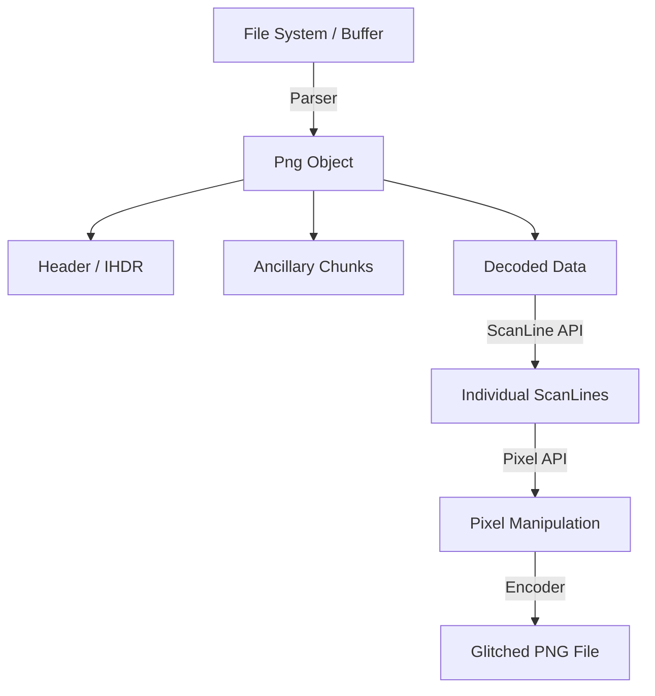

# Developer & Architecture Guide

Welcome to the `png-glitch` developer guide. This document provides an overview of the internal architecture, core concepts, and design decisions that drive the library and CLI.

## High-Level Architecture

`png-glitch` is designed to provide low-level access to the internal structures of the PNG format while offering a high-level, fluent API for creative image corruption.

### 1. The Parser (`src/png/parser.rs`)
The parser is responsible for reading the PNG signature and iterating through chunks. 
- It concatenates all `IDAT` chunks and decompresses them using the `fdeflate` crate into a single `DecodedData` buffer.
- It preserves the original order of ancillary chunks (like `PLTE` or `gAMA`) to ensure the glitched output remains a valid (though "broken") PNG.

### 2. The `Png` & `PngGlitch` Container
- **`Png`**: The internal representation of the image. It holds the `MetaData` (from `IHDR`), a list of `Chunk` objects, and the raw `DecodedData`.
- **`PngGlitch`**: The public-facing wrapper that provides the fluent API. It owns a `Png` instance and manages high-level operations like `apply(preset)` or `save()`.

### 3. ScanLines & Filters (`src/png/scan_line.rs`)
The core of the glitching logic happens at the `ScanLine` level. A PNG image is a series of scanlines, each starting with a **Filter Type** byte.
- **Filter Mismatching:** This is the primary glitch technique. By changing the filter type byte without transforming the data (or vice versa), we force the PNG decoder to misinterpret the pixel values.
- **Sequential Processing:** Many filters (like `Up` or `Paeth`) depend on the previous scanline. The library handles these dependencies correctly when "removing" or "applying" filters.

### 4. The Pixel API
To support different bit depths (1, 2, 4, 8, 16) and color types (RGB, Grayscale, etc.) without exposing the user to raw bit-shifting, we use the `Pixel` enum.
- **`process_pixels`**: This is a high-performance API that resolves the image format *once* per scanline and provides a branch-free loop for manipulation.

## Core Concepts for Contributors

### The "Glitch" Philosophy
Unlike a standard image library that aims for fidelity, `png-glitch` treats the PNG specification as a playground. We often perform operations that are "illegal" or "undefined" in standard decoders to see what visual artifacts they produce.

### Performance & Parallelism
We use the `rayon` crate for parallel scanline processing. Most glitch presets (like `Invert` or `Brighten`) are embarrassingly parallel. However, operations like `transpose` or sequential filter changes must be handled with care to maintain the image's structural integrity.

## Deep Dive Specifications

For detailed information on specific subsystems, refer to the following documents in `crates/png-glitch/specs/`:

- [**Filter System**](crates/png-glitch/specs/FILTER_SYSTEM.md): How the 5 PNG filters work and how to abuse them.
- [**Pixel Formats**](crates/png-glitch/specs/PIXEL_FORMATS.md): Details on bit depth packing and color type handling.
- [**Parsing & Encoding**](crates/png-glitch/specs/PARSING_ENCODING.md): The lifecycle of a PNG file within the library.
- [**Glitch Operations**](crates/png-glitch/specs/GLITCH_OPERATIONS.md): Technical details on transposition and presets.

## Fuzzing & Security
Because we parse raw bytes from potentially untrusted files, we maintain a fuzzer in `crates/png-glitch/fuzz/`. Contributors modifying the parser should run `cargo fuzz run` to ensure no regressions in memory safety or panic-freedom.
