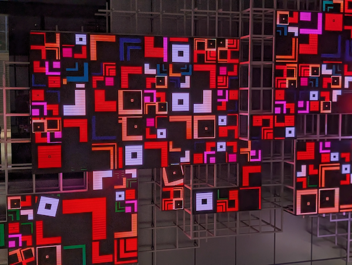
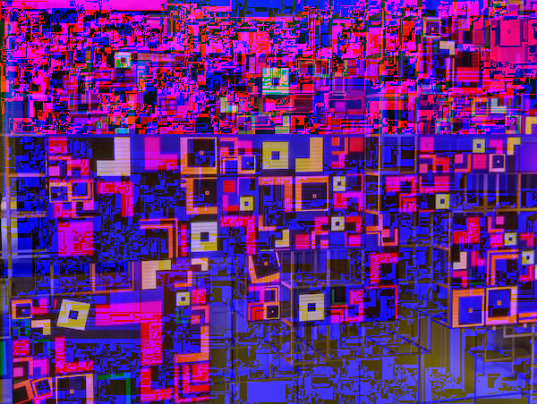

# png-glitch: a tool to glitch PNG images

## Installation

To install `png-glitch` from source, run the following command:

```zsh
% cargo install png-glitch --locked 
```

## Usage

`png-glitch` glitches given PNG file (or directory) and emits the result. By default, it saves to `glitched.png`.

### Command Line Options

| Option | Description | Visual Impact |
| :--- | :--- | :--- |
| `--transpose <N>` | Randomly swaps blocks of scanlines. | Creates horizontal "slicing" and shearing. |
| `--shift-channels <R,G,B>` | Shifts color channels independently. | Color fringing or radical color shifts. |
| `--invert` | Inverts all color values. | Classic "negative" look. |
| `--brighten <N>` | Adjusts brightness (0-255). | Can cause "blown out" or solarized effects. |
| `--replace <N>` | Replaces pixels with noise (0.0 - 1.0). | Digital "snow" or "static". |
| `--set-zero <N>` | Sets random pixels to zero (0.0 - 1.0). | Black pixel noise. |
| `--remove-filter` | Strips all PNG filters before glitching. | Cleans the canvas for more predictable results. |
| `--sub`, `--up`, `--paeth` | Force a specific PNG filter type. | Dramatic vertical or horizontal streaking. |
| `--seed <N>` | Set a seed for random operations. | Reproducible glitch patterns. |

## Batch Processing

To glitch multiple images at once, provide a directory as the main argument and use the `--batch-output` flag:

```zsh
% png-glitch ./my_images --batch-output ./glitched_results --invert --seed 12345
```

The tool will recursively find all `.png` files and process them with a progress bar.

## Configuration File

You can define complex glitch pipelines in a YAML file:

```yaml
filters:
  - type: RemoveFilter
  - type: Invert
  - type: PixelSort
    magnitude: 0.1
    criterion: hue
  - type: HorizontalShift
    magnitude: 0.05
  - type: Bitwise
    magnitude: 0.02
    op: xor
    value: 255
```

Run it with:
```zsh
% png-glitch input.png --config my_glitch.yaml
```

## Documentation

- **[CLI Usage & Visual Gallery](docs/CLI_GUIDE.md)**: A comprehensive guide to glitching with the CLI.
- **[Developer & Architecture Guide](DEVELOPER_GUIDE.md)**: Deep dive into the internal design and core concepts.
- **[Spec: Filter System](crates/png-glitch/specs/FILTER_SYSTEM.md)**: Technical details on PNG filters.
- **[Spec: Pixel Formats](crates/png-glitch/specs/PIXEL_FORMATS.md)**: How we handle different bit depths and color types.

## Example

The original image:


And the glitched one:


# In this repository
This repository consists of the following things:

- png-glitch-cli, a binary crate for a command line interface (CLI) to glitch PNG files.
- [png-glitch crate](crates/png-glitch), a library to glitch PNG images.
- [glitch-context crate](crates/glitch-context), a high-level API to orchestrate glitch filters.

# Licence

MIT License. Please refer to [LICENCE](LICENSE) file for details.
FilterType
    magnitude: 0.05
```

Run it with:
```zsh
% png-glitch input.png --config my_glitch.yaml
```

## Documentation

- **[CLI Usage & Visual Gallery](docs/CLI_GUIDE.md)**: A comprehensive guide to glitching with the CLI.
- **[Developer & Architecture Guide](DEVELOPER_GUIDE.md)**: Deep dive into the internal design and core concepts.
- **[Spec: Filter System](crates/png-glitch/specs/FILTER_SYSTEM.md)**: Technical details on PNG filters.
- **[Spec: Pixel Formats](crates/png-glitch/specs/PIXEL_FORMATS.md)**: How we handle different bit depths and color types.

## Example

The original image:


And the glitched one:


# In this repository
This repository consists of the following things:

- png-glitch-cli, a binary crate for a command line interface (CLI) to glitch PNG files.
- [png-glitch crate](crates/png-glitch), a library to glitch PNG images.
- [glitch-context crate](crates/glitch-context), a high-level API to orchestrate glitch filters.

# Licence

MIT License. Please refer to [LICENCE](LICENSE) file for details.
