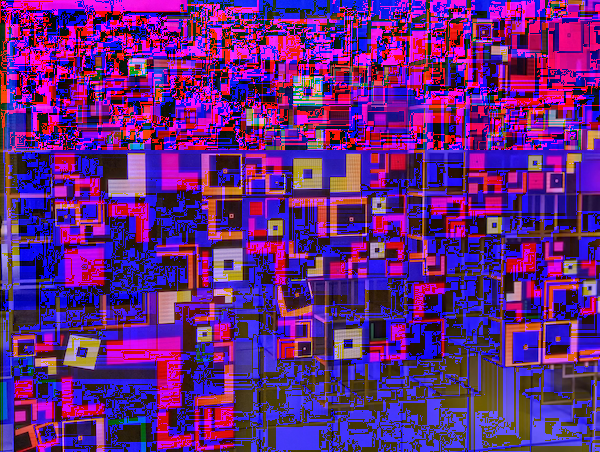

# png-glitch: a tool to glitch PNG images

## Installation

To install `png-glitch` from source, run the following command:

```zsh
% cargo install png-glitch --locked 
```

## Usage

`png-glitch` glitches given PNG file and emit it to `glitched.png`. The file name for the glitched PNG file can be specified with `-o` option. Please run the command with `--help` option for full option: 

```zsh
Usage: png-glitch [OPTIONS] <PNG_FILE>

Arguments:
  <PNG_FILE>

Options:
  -o <OUTPUT_FILE>      [default: glitched.png]
  -h, --help            Print help
```

## Example

The original image:


And the glitched one:


# In this repository
This repository consists of the following things:

- png-glitch-cli, a binary crate for a command line interface (CLI) to glitch PNG files.
- [png-glitch crate](crates/png-glitch), a library to glitch PNG images.

png-glitch-cli is a sort of sample code to show basic usage of png-glitch create, for now.

# Licence

MIT License. Please refer to [LICENCE](LICENSE) file for details.