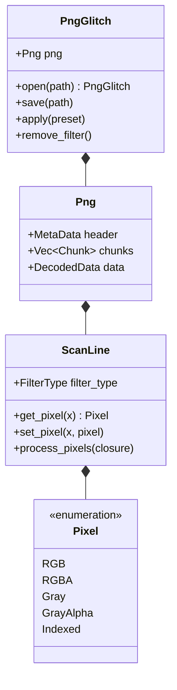

# png-glitch

A library to glitch PNG files. This library is inspired by the [pnglitch](https://github.com/ucnv/pnglitch), a Ruby library to glitch PNG images.

Please visit "[The Art of PNG Glitch](https://ucnv.github.io/pnglitch/)" for more details about glitching PNG images.


The original image: 


# Data Structures



# Example usage

The library now features a **Chainable API**, **Structured Pixel API**, and **Parallel Processing**.

The following snippet glitches `./a_png_file.png` by:
1. Removing existing PNG filters.
2. Applying an **Invert** preset.
3. Brightening the image using a **Brighten** preset.
4. Customizing a specific pixel using the safe **Pixel API**.

The glitched image is saved to `./glitched.png`.

```Rust
use png_glitch::{PngGlitch, Pixel};
use png_glitch::presets::{Invert, Brighten};

PngGlitch::open("./a_png_file.png")?
  .remove_filter()
  .apply(Invert)
  .apply(Brighten { strength: 50 })
  .par_foreach_scanline(|scan_line| {
    // High-performance parallel pixel manipulation
    if let Some(Pixel::RGB(r, g, b)) = scan_line.get_pixel(10) {
        scan_line.set_pixel(10, Pixel::RGB(r, 0, b));
    }
  })
  .save("./glitched.png")?;
```

# Available Presets (Recipes)

Built-in glitch recipes available in `png_glitch::presets`:

- **Invert**: Flips color values.
- **ShiftChannels**: Moves color channels (R, G, B) independently.
- **Brighten**: Increases or decreases image brightness.

# Key Features

- **Parallelism**: Use `par_foreach_scanline` to glitch large images fast using all CPU cores.
- **Memory Safety**: 100% safe Rust code with no `unsafe` blocks.
- **Structured Pixels**: Manipulate images at the pixel level without worrying about raw byte offsets.

# Contribution

1. Fork the repository.
2. Create a feature branch on your forked repository with `git checkout -b feature-name` command.
3. Develop the feature.
4. Commit your changes with `git commit` command.
5. Upload the feature branch to GitHub and create a pull request.

# License

Please refer to the [LICENSE](LICENSE) file.