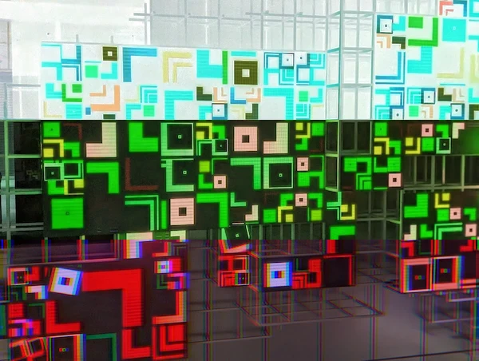
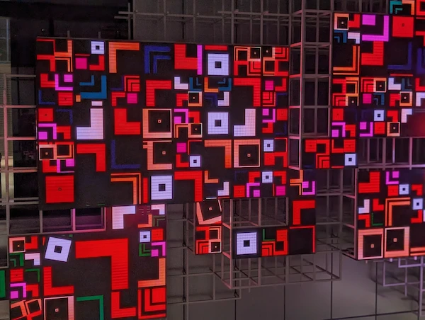
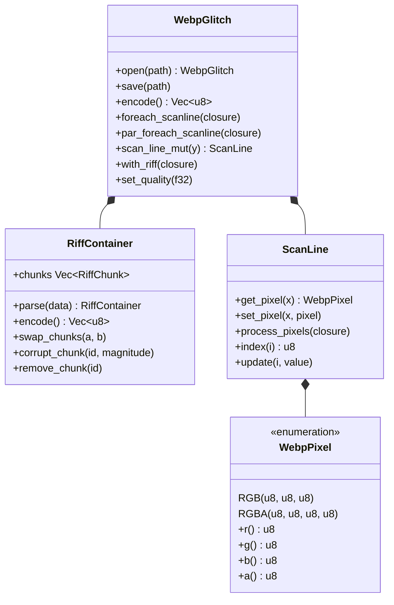

# webp-glitch

A library to glitch WebP images in Rust. Part of the [png-glitch](https://github.com/chikoski/png-glitch) project.



The original image:



## Features

- **RIFF-level operations**: Directly manipulate WebP chunk structure (swap, corrupt, tamper sizes, remove, duplicate chunks)
- **Pixel pipeline**: Decode → glitch → re-encode via libwebp with full pixel-level access
- **Scan-line API**: Row-by-row manipulation compatible with `glitch-context` filter ecosystem
- **Parallel processing**: `par_foreach_scanline` for multi-core glitching with rayon
- **WebP-specific filters**: `MacroblockGlitch`, `AlphaGlitch`, `LossyArtifact`

## Data Structures



## Example

```rust
use webp_glitch::{WebpGlitch, WebpPixel};

let mut glitch = WebpGlitch::open("input.webp")?;

// 色反転
glitch.foreach_scanline(|line| {
    line.process_pixels(|_, p| match p {
        WebpPixel::RGB(r, g, b) => WebpPixel::RGB(255 - r, 255 - g, 255 - b),
        WebpPixel::RGBA(r, g, b, a) => WebpPixel::RGBA(255 - r, 255 - g, 255 - b, a),
    });
});

glitch.save("glitched.webp")?;
```

より詳しいサンプルは [`examples/glitch.rs`](examples/glitch.rs) を参照してください:

```bash
cargo run --example glitch
```

## glitch-context との統合

[`glitch-context`](../glitch-context) クレートを通じて、既存のフィルター群を WebP にも適用できます:

```rust
use glitch_context::{WebpGlitchContext, MacroblockGlitch, AlphaGlitch, AlphaGlitchStrategy};

let mut ctx = WebpGlitchContext::open("input.webp", Some(42))?;
ctx.add_filter(MacroblockGlitch { magnitude: 0.3 });
ctx.add_filter(AlphaGlitch { magnitude: 0.5, strategy: AlphaGlitchStrategy::Invert });
ctx.execute();
ctx.save("glitched.webp")?;
```

### 利用可能なフィルター

| フィルター | 説明 |
| :--- | :--- |
| `WebpInvert` | 全チャンネルを反転 |
| `WebpBrighten` | 輝度加算 |
| `WebpShiftChannels` | RGB チャンネルをシフト |
| `PixelSort` | 輝度または色相でピクセルをソート |
| `Bitwise` | AND / OR / XOR ビット演算 |
| `ChannelSwap` | RGB チャンネルを入れ替え |
| `HorizontalShift` | スキャンラインを水平にシフト |
| `ColorDistortion` | ランダムな色ノイズを加算 |
| `ChromaticAberration` | チャンネル別水平オフセット |
| `MacroblockGlitch` | 16×16 マクロブロック単位で入れ替え（WebP 専用）|
| `AlphaGlitch` | アルファチャンネルのみを破壊（WebP 専用）|
| `LossyArtifact` | 再エンコード品質を下げて DCT アーティファクトを加える（WebP 専用）|

## License

Please refer to the [LICENSE](LICENSE) file.
