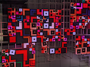

# png-glitch CLI Usage Guide & Visual Gallery

This guide provides a comprehensive overview of the `png-glitch` command-line options and the visual effects they produce.

## Basic Usage

```zsh
png-glitch <INPUT_PNG> [OPTIONS]
```

By default, the glitched image is saved as `glitched.png`. Use `-o <FILE>` to specify a different output path.

---

## Glitch Filters & Visual Impact

### 1. Color Manipulation

| Option | Description | Visual Impact |
| :--- | :--- | :--- |
| `--invert` | Inverts all color values. | Classic "negative" look. |
| `--brighten <N>` | Increases brightness (0-65535). | Blown-out highlights or solarized effects. |
| `--shift-channels <R,G,B>` | Shifts color channels independently. | Color fringing and radical color shifts. |
| `--color-distortion <MAG>, <STR>` | Adds random noise to pixel values. | Analog-style noise and grain. |

### 2. Structural Glitches (Scanline Level)

| Option | Description | Visual Impact |
| :--- | :--- | :--- |
| `--transpose <MAG>` | Swaps individual scanlines. | Horizontal "slicing" and shearing. |
| `--horizontal-shift <MAG>` | Shifts scanlines horizontally with wrap-around. | Digital "offset" look. |
| `--block-scramble <MAG>, <SIZE>` | Shuffles grid-based blocks of pixels. | Fractured and mosaic-like corruption. |
| `--random-copy <N>` | Copies random scanlines to other positions. | Vertical repetition and "smearing". |

### 3. Bit-Level & Noise

| Option | Description | Visual Impact |
| :--- | :--- | :--- |
| `--replace <MAG>` | Replaces random bytes with noise. | Extreme digital "snow". |
| `--set-zero <MAG>` | Sets random bytes to zero. | Black pixel artifacts. |
| `--bitwise <MAG>, --bitwise-op <OP>, --bitwise-value <V>` | Performs logical operations on bytes. | Harsh mathematical distortion. |

### 4. PNG Filter Abuse (The Core Glitch)

These options manipulate the internal PNG filter types without re-encoding the data, causing decoders to misinterpret the pixels.

| Option | Description | Visual Impact |
| :--- | :--- | :--- |
| `--remove-filter` | Strips all filters before glitching. | Clean base for predictable results. |
| `--sub` / `--up` / `--average` / `--paeth` | Forces a specific filter type repo-wide. | Dramatic vertical/horizontal streaking. |
| `--change-filter-type <MAG>` | Randomly changes filter types per scanline. | Multi-directional chaotic artifacts. |

---

## Visual Gallery

### Original Image


### Example Effects

#### Transpose (`--transpose 0.1`)
Creates horizontal shifts by swapping rows.


#### Filter Abuse (`--paeth`)
Forces the Paeth predictor, creating complex recursive patterns.


#### Integrated Glitch
Combining multiple filters for a unique look.


---

## Batch Processing

Process an entire directory of PNGs in parallel:

```zsh
png-glitch ./my_photos --batch-output ./distorted_gallery --invert --block-scramble 0.05
```

## Configuration Files (YAML)

For complex, repeatable pipelines:

```yaml
# glitch_config.yaml
filters:
  - type: RemoveFilter
  - type: BlockScramble
    magnitude: 0.1
    block_size: 32
  - type: ColorDistortion
    magnitude: 0.2
    strength: 50
  - type: Invert
```

Run with: `png-glitch input.png --config glitch_config.yaml`
